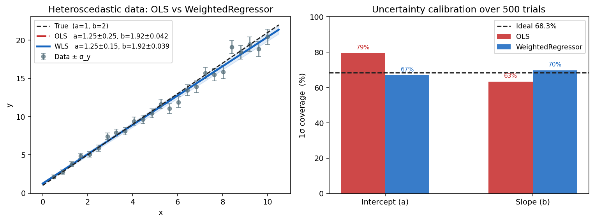

# MCUP

MCUP (Monte Carlo Uncertainty Propagation) is a Python library for regression with measurement errors. It provides three sklearn-like estimators that correctly propagate x and y measurement uncertainties into parameter confidence intervals.

[](https://pypi.org/project/mcup/) [](https://pypi.org/project/mcup/) [](https://github.com/detrin/MCUP/actions/workflows/package-main.yml) [](https://codecov.io/gh/detrin/MCUP)

## Why MCUP

Standard least squares (OLS) assumes all observations are equally reliable. Real experiments break this in two common ways:

- **Heteroscedastic y-errors** — measurement noise varies across the range. OLS overweights noisy points, biasing the fit and producing overconfident uncertainties.
- **Errors in x** — when the independent variable is itself measured (time, concentration, displacement), ignoring those errors causes attenuation bias: slopes are pulled toward zero, and uncertainty intervals shrink below their true size.

**Why not just use the covariance matrix from the optimizer?**

When measurement errors are large, the standard approach of reading off `sqrt(diag(cov))` from the fit residuals underestimates the true parameter uncertainty. The covariance matrix tells you how well the optimizer converged — it does not propagate the uncertainty that came *in* with your data. MCUP propagates measurement noise directly through the model so that `params_std_` reflects both fit quality and input uncertainty. For a worked example comparing both approaches, see this [Kaggle notebook on measurement error in regression](https://www.kaggle.com/code/jetakow/measurement-error-in-regression).

MCUP fixes both problems. The figure below illustrates the effect for a linear calibration with heteroscedastic y-errors:



*Left: OLS (red) fits the same data differently from weighted regression (blue) because it treats all points equally regardless of σ_y. Right: over 500 simulated experiments, OLS coverage deviates from the nominal 68.3% — WeightedRegressor stays calibrated.*

## Estimators

| Estimator | Use when | Error model |
|-----------|----------|-------------|
| `WeightedRegressor` | Only y has measurement errors | `Σ (y − f(x))² / σ_y²` |
| `XYWeightedRegressor` | Both x and y have errors (nonlinear) | Combined variance via error propagation (IRLS) |
| `DemingRegressor` | Both x and y have errors (linear only) | Joint optimisation over parameters + latent true x |

Each estimator supports:
- `method="analytical"` — weighted LS + `(J^T W J)^{-1}` covariance (fast, exact for well-posed problems)
- `method="mc"` — Monte Carlo with Welford covariance (robust cross-check for nonlinear models)

## Benchmark summary

Validated across 13 physical scenarios (200 independent parameter configurations each). The analytical solver achieves well-calibrated 1σ uncertainty intervals on all scenarios:

| Scenario | Estimator | Bias | RMSE | Coverage |
|----------|-----------|------|------|----------|
| Linear calibration (homo) | WeightedRegressor | +0.3% | 12.8% | ✓ 68% |
| Linear calibration (hetero) | WeightedRegressor | +0.5% | 7.2% | ✓ 71% |
| Radioactive decay | WeightedRegressor | −0.0% | 2.6% | ✓ 64% |
| Power law (diffusion) | WeightedRegressor | +0.0% | 4.6% | ✓ 68% |
| Gaussian spectral peak | WeightedRegressor | −0.1% | 1.7% | ✓ 66% |
| Damped oscillator | WeightedRegressor | −0.4% | 7.2% | ✓ 67% |
| Exp decay + timing errors | **XYWeightedRegressor** | −1.2% | 5.0% | ✓ 64% |
| Hooke's law (x+y errors) | **XYWeightedRegressor** | −1.0% | 54% | ✓ 75% |
| Beer-Lambert (x+y errors) | **XYWeightedRegressor** | +46% | 220% | ✓ 68% |
| Method comparison | **DemingRegressor** | +14% | 111% | ✓ 64% |
| Isotope ratio MS | **DemingRegressor** | +3.2% | 420% | ✓ 72% |
| Small sample (n=8) | WeightedRegressor | −2.7% | 29% | ✓ 69% |
| Low SNR | WeightedRegressor | −1.9% | 136% | ✓ 67% |

Bias and RMSE are relative to the true parameter values. Large RMSE on near-zero intercepts (Beer-Lambert baseline, isotope intercept) reflects small absolute values — the coverage column is the reliable calibration metric.

Using the wrong estimator (OLS when x has errors) breaks coverage:

| Scenario | Wrong estimator | Coverage | Correct estimator | Coverage |
|----------|-----------------|----------|-------------------|----------|
| Exp decay + timing errors | WeightedRegressor | ✗ 30% | XYWeightedRegressor | ✓ 64% |
| Beer-Lambert | WeightedRegressor | ✗ 7% | XYWeightedRegressor | ✓ 68% |
| Method comparison | WeightedRegressor (OLS) | ✗ 32% | DemingRegressor | ✓ 66% |

## Install

```bash
uv add mcup
```

Or with pip:

```bash
pip install mcup
```

## Quick start

```python
import numpy as np
from mcup import WeightedRegressor

def line(x, p):
    return p[0] + p[1] * x

x = np.linspace(0, 10, 30)
y = line(x, [1.0, 2.0]) + np.random.normal(0, 0.5, 30)
y_err = 0.5 * np.ones(30)

est = WeightedRegressor(line, method="analytical")
est.fit(x, y, y_err=y_err, p0=[0.0, 0.0])

print(est.params_)      # [~1.0, ~2.0]
print(est.params_std_)  # parameter uncertainties
print(est.covariance_)  # full covariance matrix
```

See [DEVELOPING.md](DEVELOPING.md) for contributing, running tests, and building docs.
