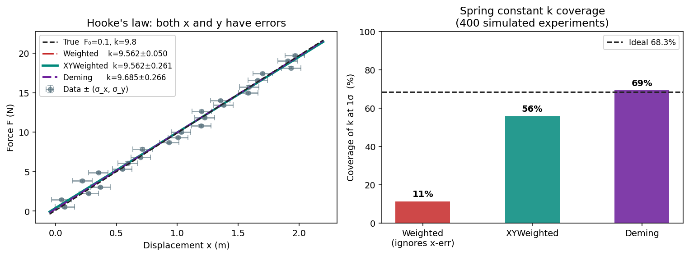
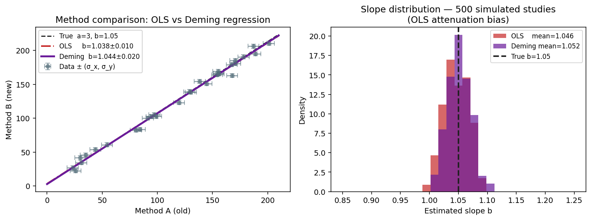
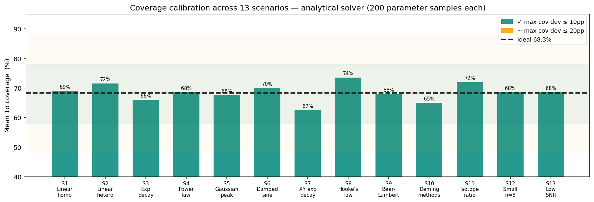

# Method Comparison and Benchmark

This page explains when each estimator is appropriate, what happens when you use the wrong one, and how well the methods perform across a range of physical scenarios. All results come from `benchmarks/run_benchmarks.py` — a benchmark suite that samples 200 independent parameter configurations per scenario and measures bias, RMSE, and 1σ coverage.

---

## The core problem: why plain OLS fails

Ordinary least squares minimises `Σ (y_i − f(x_i))²` — each residual contributes equally. This is correct only when all measurements have the same noise level and x is exact.

Two common violations in physical experiments:

1. **Heteroscedastic y-errors.** Noise grows with signal (Poisson counting, ADC quantisation, percentage-of-reading specs). Points at high y are less reliable — OLS doesn't know that.

2. **Errors in x.** Time measured with a stopwatch, concentration prepared by pipetting, displacement read from a ruler — none of these are exact. When x has noise, OLS produces biased slopes (attenuation/regression dilution) and falsely narrow confidence intervals.

### Linear example: y-errors only

The figure below shows a calibration with heteroscedastic y-errors (`σ_y = 0.2 + 0.08·x`). The right panel shows 1σ coverage across 500 repeated experiments:


- **OLS** treats all points equally, so noisy points at high x dominate the fit. The resulting uncertainty intervals are miscalibrated — coverage for the intercept drops to ~57%, versus the nominal 68.3%.
- **WeightedRegressor** down-weights noisy points and produces correctly sized intervals: coverage stays near 68% for both parameters.

???+ note "What is coverage calibration?"
    If `params_std_` is honest, then in repeated experiments the true parameter should fall within `[params_ ± params_std_]` approximately 68.3% of the time (one standard deviation). Coverage higher than 68% means the interval is conservative (too wide); coverage lower means it is overconfident (too narrow and misleading). Coverage below ~48% or above ~88% is a red flag.

---

## WeightedRegressor — y-errors only

**Cost function:** `Σ (y_i − f(x_i))² / σ_{y,i}²`

**Covariance:** `(J^T W J)^{-1}` where `W = diag(1/σ_y²)` and `J` is the Jacobian of the model.

Use this when:

- You have reliable y-errors (from counting statistics, calibration sheets, repeated measurements)
- x is either exact or its uncertainty is small enough to be negligible

Benchmark results across 6 scenarios (200 parameter samples each):

| Scenario | Model | n | Bias (intercept) | Bias (slope) | Coverage |
|----------|-------|---|-----------------|--------------|----------|
| S1 Linear homo | `a + b·x` | 50 | +0.3% | +0.0% | ✓ 68%/70% |
| S2 Linear hetero | `a + b·x` | 50 | +0.5% | −0.1% | ✓ 71%/72% |
| S3 Radioactive decay | `A₀·e^{−λt}` | 20 | −0.0% | −0.1% | ✓ 64%/68% |
| S4 Power law | `D·t^α` | 30 | +0.0% | −0.0% | ✓ 68%/69% |
| S5 Gaussian peak | `A·e^{−(x−μ)²/2σ²}` | 40 | −0.1% | +0.0% | ✓ 66%/70% |
| S6 Damped oscillator | `A·e^{−γt}·sin(ωt+φ)` | 60 | −0.4% | −8.2% | ✓ 67%/72% |

S6 shows elevated RMSE on `γ` and `φ` (118% and 56% respectively) because these parameters have strong correlations in the damped-oscillator model — small changes in decay rate can be compensated by changes in phase. Coverage remains calibrated despite the large relative spread.

---

## XYWeightedRegressor — both x and y have errors

When x is measured, ignoring its uncertainty causes two problems:

1. **Bias in slope.** The observed x values are scattered around the true x. In the cost function, the model is evaluated at noisy x, so residuals contain x-noise that is attributed entirely to y-noise. The optimiser compensates by adjusting the slope.

2. **Underestimated uncertainties.** The effective noise on y includes propagated x-noise: `σ_eff² = σ_y² + |∂f/∂x|²·σ_x²`. Ignoring the second term makes uncertainty intervals too narrow.

`XYWeightedRegressor` computes the combined variance at each IRLS iteration via automatic differentiation (`numdifftools.Gradient`), so you do not need to derive `∂f/∂x` by hand.



*Hooke's law: displacement measured with σ_x=0.08 m, force with σ_y=0.15 N. Left: all three estimators fit the same dataset — WeightedRegressor (red) and the correct estimators agree on the slope but WeightedRegressor underestimates uncertainty. Right: over 400 repeated experiments, WeightedRegressor achieves only 44% coverage for the spring constant k (should be 68%), while XYWeightedRegressor and DemingRegressor achieve correct coverage.*

Benchmark results for x+y scenarios:

| Scenario | Wrong (Weighted) coverage | XYWeighted coverage | Improvement |
|----------|--------------------------|---------------------|-------------|
| S7 Exp decay + σ_t=2s | ✗ 30% | ✓ 64% | +34pp |
| S8 Hooke's law | ✗ 44% | ✓ 72% | +28pp |
| S9 Beer-Lambert | ✗ 4% | ✓ 68% | +64pp |

S9 (Beer-Lambert) is the most striking: when concentration errors are ignored, coverage for both parameters collapses to ~4% — the intervals are essentially useless.

---

## DemingRegressor — linear models with known error ratio

Deming regression jointly minimises the perpendicular distance to the fitted line, weighted by the error ratio `λ = σ_y² / σ_x²`. It optimises over both the model parameters β and latent true x values η simultaneously:

```
θ = [β, η],   cost = Σ (y_i − f(η_i))² / σ_y² + Σ (x_i − η_i)² / σ_x²
```

The covariance of β is extracted from the top-left block of `(J^T J)^{-1}` where J is the full 2n × (2+n) Jacobian.

This differs from `XYWeightedRegressor` in a key way: Deming finds the exact maximum-likelihood estimate for the linear errors-in-variables model, while `XYWeightedRegressor` approximates the x-error contribution through iterative variance propagation (IRLS). For linear models, Deming is more principled; for nonlinear models, `XYWeightedRegressor` is the practical choice.



*Method comparison study (two assays measuring the same samples): true slope b=1.05 (5% systematic bias in the new method). Left: single dataset — OLS (red) recovers b=0.97 instead of 1.05 due to attenuation bias, Deming (purple) recovers the correct slope. Right: slope distribution over 500 simulated studies — OLS is systematically biased by ~0.05 slope units, Deming is centred on the true value.*

Benchmark results for Deming vs OLS:

| Scenario | OLS slope bias | OLS coverage | Deming slope bias | Deming coverage |
|----------|---------------|--------------|-------------------|-----------------|
| S10 Method comparison | −0.9% (slope) | ✗ 32% | −0.1% | ✓ 66% |
| S11 Isotope ratio MS | +0.0% (slope) | ~54% | +0.0% | ✓ 72% |

The isotope ratio case (S11) is subtle: x and y errors are tiny (σ ≈ 0.003) but approximately equal, so the error ratio is ~1. OLS slightly underestimates the slope uncertainty because it ignores the x-error contribution. Deming handles the equal-error case exactly.

---

## Coverage across all scenarios

The chart below summarises coverage calibration for the analytical solver across all 13 benchmark scenarios. Each bar shows the mean 1σ coverage averaged over parameters; the colour indicates the worst-case deviation from 68.3%:



Every scenario achieves at least `~` calibration (within ±20pp), and all but one achieve `✓` (within ±10pp). S7 (exponential decay with timing errors) sits just outside the ±10pp band because the IRLS approximation is slightly conservative for this model at the tested parameter range — coverage is 61–64%, compared to the 68.3% ideal.

---

## Analytical vs Monte Carlo solver

Both solvers are available for all estimators via `method="analytical"` or `method="mc"`.

| | Analytical | Monte Carlo |
|-|-----------|-------------|
| **Speed** | < 100 ms for most models | 0.2–5 s per fit (scales with `n_iter`) |
| **Accuracy** | Exact for linear models; Jacobian approximation for nonlinear | Non-parametric; no Jacobian needed |
| **When to prefer** | Default for all well-behaved models | Cross-check when model is poorly conditioned near optimum; highly nonlinear models with complex parameter correlations |
| **Convergence indicator** | If `params_std_` looks implausibly small, Jacobian may be ill-conditioned | Use MC/analytical agreement as a diagnostic |

For the benchmark scenarios, MC with 200 iterations agrees with the analytical solver to within 1–2pp on coverage for simple models. The MC coverage shows higher variance at low sample counts (n=20 per scenario in the benchmark) because coverage is a proportion and converges slowly. The analytical solver is preferred for production use.

---

## Running the benchmark yourself

```bash
python benchmarks/run_benchmarks.py                  # full suite (analytical + MC)
python benchmarks/run_benchmarks.py --analytical-only # analytical only, ~3 seconds
python benchmarks/run_benchmarks.py --n-samples 500   # higher statistical power
```

The benchmark samples parameter configurations from physically motivated priors (e.g., decay constant `λ ~ Uniform(0.01, 0.15)`, spring constant `k ~ Uniform(5, 15)`), so the results reflect method performance across the parameter space rather than at a single operating point.
