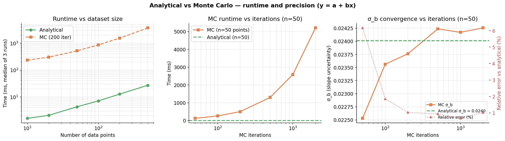

# Performance: Analytical vs Monte Carlo

This page compares the runtime and precision of the **analytical** and **Monte Carlo** error
propagation methods in MCUP, using a simple linear model `y = a + bx` as a benchmark.

## Setup

```python
import numpy as np
from mcup import WeightedRegressor

def line(x, p):
    return p[0] + p[1] * x

# 50 points, y-errors of 0.5, true params: a=1, b=2
x = np.linspace(0, 10, 50)
y_err = 0.5 * np.ones(50)
y = 1.0 + 2.0 * x + np.random.normal(0, y_err)

# Analytical
est_a = WeightedRegressor(line, method="analytical")
est_a.fit(x, y, y_err=y_err, p0=[0.0, 1.0])

# Monte Carlo (500 iterations)
est_mc = WeightedRegressor(line, method="mc", n_iter=500)
est_mc.fit(x, y, y_err=y_err, p0=[0.0, 1.0])
```

## Results



### Runtime vs number of data points

MC used 200 iterations fixed. Median of 3 runs.

| n points | Analytical (ms) | MC 200 iter (ms) | Speedup |
|--------:|----------------:|-----------------:|--------:|
| 10      | 1.6             | 234.8            | 145×    |
| 20      | 2.1             | 303.6            | 146×    |
| 50      | 4.3             | 519.1            | 120×    |
| 100     | 7.2             | 865.3            | 121×    |
| 200     | 12.9            | 1548.1           | 120×    |
| 500     | 27.3            | 3699.9           | 135×    |

The analytical method scales roughly **linearly** with n, since it solves the normal equations
directly. MC scales linearly too, but with a constant overhead of ~2.5 ms per iteration — 
**100–150× slower** than analytical at the same dataset size.

### MC precision vs number of iterations (n=50 points)

The analytical result (σ_b = 0.02401) serves as the reference.

| MC iterations | σ_b    | Error vs analytical | Time (ms) |
|--------------:|-------:|--------------------:|----------:|
| 50            | 0.02253 | 6.2%               | 125       |
| 100           | 0.02356 | 1.9%               | 259       |
| 200           | 0.02376 | 1.0%               | 502       |
| 500           | 0.02424 | 0.9%               | 1304      |
| 1000          | 0.02417 | 0.7%               | 2586      |
| 2000          | 0.02425 | 1.0%               | 5206      |
| **Analytical**| **0.02401** | **0.0%**       | **4**     |

With 200 iterations the MC result is already within ~1% of the analytical value, but takes
~120× longer. With 500 iterations the error is sub-1%, at a cost of ~300×.

## When to use each method

| Scenario | Recommended method |
|---|---|
| Model has analytical Jacobian; speed matters | **Analytical** |
| Small dataset, need a quick check | **Analytical** |
| Model has no closed-form derivatives | **MC** |
| Non-Gaussian or asymmetric uncertainties | **MC** |
| Exploring sensitivity, need the full posterior | **MC** |

**Rule of thumb:** use `method="analytical"` (the default) unless you have a specific reason
to need Monte Carlo sampling. If you do use MC, 200–500 iterations is usually sufficient
for uncertainties at the ~1% level.
