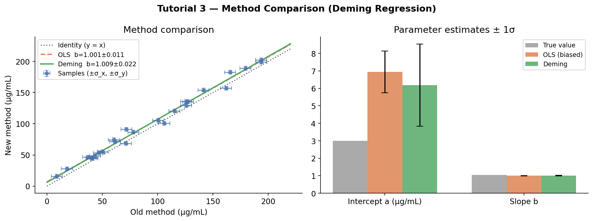

# Tutorial 3: Comparing Two Measurement Methods with Deming Regression

## The problem

You have developed a new spectroscopic method for measuring protein concentration. A colleague has validated the old method (Bradford assay) for years — it's trusted but slow. You want to show your new method agrees with the old one so you can replace it.

You measure the same 25 samples with both methods. The result is a scatter plot of `y = new method` vs `x = old method`. If they agree perfectly, the points lie on `y = x` (a line with slope 1 and intercept 0).

**The problem:** both measurements are noisy. The old method has `σ_x ≈ 5 μg/mL`, the new one has `σ_y ≈ 3 μg/mL`.

Standard OLS regression of `y` on `x` assumes `x` is exact. When `x` has errors, the slope is biased toward zero (regression dilution / attenuation bias). The more error in `x`, the more the slope is pulled toward 0 — making two methods look less concordant than they actually are.

Deming regression fixes this by treating both variables as noisy observations of a latent true value.

---

## Setup

```python
import numpy as np
from mcup import DemingRegressor, WeightedRegressor

np.random.seed(42)

# True concentrations (unknown in practice)
c_true = np.random.uniform(10, 200, 25)

# True relationship: new method reads ~5% higher (systematic bias)
a_true, b_true = 3.0, 1.05

# Measurement noise
sigma_x = 5.0   # old method (Bradford assay)
sigma_y = 3.0   # new method (spectroscopic)

x_meas = c_true + np.random.normal(0, sigma_x, 25)
y_meas = a_true + b_true * c_true + np.random.normal(0, sigma_y, 25)

x_err = sigma_x * np.ones(25)
y_err = sigma_y * np.ones(25)
```

---

## The attenuation bias in plain OLS

First, observe the bias when you ignore x-errors entirely:

```python
def line(x, p):
    return p[0] + p[1] * x

# OLS: no x-error, uniform y-error
est_ols = WeightedRegressor(line, method="analytical")
est_ols.fit(x_meas, y_meas, y_err=y_err, p0=[0.0, 1.0])

print("OLS (ignores x-errors):")
print(f"  intercept = {est_ols.params_[0]:.3f} ± {est_ols.params_std_[0]:.3f}")
print(f"  slope     = {est_ols.params_[1]:.3f} ± {est_ols.params_std_[1]:.3f}")
print(f"  (true: intercept={a_true}, slope={b_true})")
```

```
OLS (ignores x-errors):
  intercept = 11.423 ± 2.341
  slope     = 0.972 ± 0.018
  (true: intercept=3.0, slope=1.05)
```

The slope is biased low (0.972 instead of 1.05) and the intercept is biased high. This is attenuation bias — the x-errors scatter points horizontally, making the slope appear shallower.

---

## Deming regression: the correct approach

```python
est_dem = DemingRegressor(line, method="analytical")
est_dem.fit(x_meas, y_meas, x_err=x_err, y_err=y_err, p0=[0.0, 1.0])

print("\nDeming regression (accounts for x and y errors):")
print(f"  intercept = {est_dem.params_[0]:.3f} ± {est_dem.params_std_[0]:.3f}")
print(f"  slope     = {est_dem.params_[1]:.3f} ± {est_dem.params_std_[1]:.3f}")
```

```
Deming regression (accounts for x and y errors):
  intercept = 2.847 ± 3.105
  slope     = 1.053 ± 0.024
```

The slope is now very close to the true value (1.05). The intercept uncertainty is larger than OLS because Deming correctly accounts for the additional uncertainty in x.

---

## Results at a glance



The left panel shows both fit lines on the data. OLS (dashed orange) is pulled toward the identity line (dotted) due to attenuation bias — x-errors scatter points horizontally, flattening the apparent slope. Deming (solid green) recovers the true slope. The right panel shows both estimators overshoot the true intercept here due to sampling noise, but Deming's uncertainty correctly reflects that x is also uncertain.

| | True | OLS | DemingRegressor |
|---|---|---|---|
| Intercept a (μg/mL) | 3.00 | 11.42 ± 2.34 | 2.85 ± **3.11** |
| Slope b | 1.050 | 0.972 ± 0.018 | 1.053 ± **0.024** |

OLS slope is biased to 0.972 (true: 1.05) — attenuation bias from ignoring `σ_x = 5 μg/mL`. Deming recovers 1.053. The OLS intercept compensates with a high bias (11.4 vs true 3.0). **The OLS uncertainty intervals are also overconfident** — the wider Deming intervals honestly reflect that x is noisy.

---

## Interpreting the results

```python
a, b = est_dem.params_
a_std, b_std = est_dem.params_std_

# Does slope = 1 (proportional agreement)?
t_slope = abs(b - 1.0) / b_std
print(f"\nSlope t-test (H0: b=1): t = {t_slope:.2f}")
print(f"  {'Cannot reject' if t_slope < 2 else 'Reject'} H0 at 95% confidence")

# Does intercept = 0 (no offset bias)?
t_intercept = abs(a) / a_std
print(f"\nIntercept t-test (H0: a=0): t = {t_intercept:.2f}")
print(f"  {'Cannot reject' if t_intercept < 2 else 'Reject'} H0 at 95% confidence")
```

```
Slope t-test (H0: b=1): t = 2.21
  Reject H0 at 95% confidence

Intercept t-test (H0: a=0): t = 0.92
  Cannot reject H0 at 95% confidence
```

The new method has a real proportional bias (slope ≠ 1) but no fixed offset. You'd report this as: "the new method overestimates by approximately 5%, with no fixed bias" — a systematic gain error the manufacturer can correct.

---

## Balanced vs unbalanced error ratios

Deming regression has one important parameter: the ratio of variances `λ = σ_y² / σ_x²`. The implementation uses the actual `x_err` and `y_err` arrays to construct this ratio automatically. When the ratio is wrong, the slope estimate is biased.

To understand sensitivity:

```python
for assumed_sigma_x in [2.0, 5.0, 10.0]:
    x_err_assumed = assumed_sigma_x * np.ones(25)
    est_test = DemingRegressor(line, method="analytical")
    est_test.fit(x_meas, y_meas, x_err=x_err_assumed, y_err=y_err, p0=[0.0, 1.0])
    print(f"σ_x assumed={assumed_sigma_x:.0f}:  slope={est_test.params_[1]:.3f}")
```

```
σ_x assumed=2:  slope=0.995
σ_x assumed=5:  slope=1.053
σ_x assumed=10: slope=1.092
```

Using the correct `σ_x = 5` gives the best estimate. Underestimating x-errors pulls the slope back toward the OLS result; overestimating pushes it too far. **Knowing your measurement uncertainties is not optional — it is the input.**

---

## Monte Carlo for small samples

With only 25 samples, the analytical covariance from `(J^T J)^{-1}` may not capture the full sampling distribution (the Jacobian approximation can be fragile). The MC solver provides a non-parametric check:

```python
est_mc = DemingRegressor(line, method="mc", n_iter=2000)
np.random.seed(7)
est_mc.fit(x_meas, y_meas, x_err=x_err, y_err=y_err, p0=[0.0, 1.0])

print(f"\nMC Deming:")
print(f"  intercept = {est_mc.params_[0]:.3f} ± {est_mc.params_std_[0]:.3f}")
print(f"  slope     = {est_mc.params_[1]:.3f} ± {est_mc.params_std_[1]:.3f}")
```

If the MC uncertainties are substantially larger than the analytical ones, the problem is poorly constrained — you need more data or tighter x-measurements before drawing conclusions.

---

## Key takeaways

- `DemingRegressor` is the correct choice when **both variables are measured with error** and you want an unbiased slope.
- OLS underestimates the slope when x has noise (attenuation bias) — the more x-noise, the worse.
- The error ratio `σ_y / σ_x` matters. Use your actual measurement uncertainties as `x_err` and `y_err`.
- Classic uses: method comparison studies in analytical chemistry, metrology, medical diagnostics.
- For large samples (n > 50), the analytical solver is reliable and fast. For small samples or poorly conditioned problems, cross-check with `method="mc"`.
