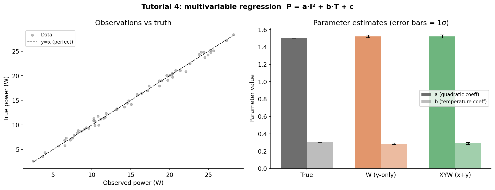

# Tutorial 4: Multivariable Regression

## The problem

You are characterising the heat output of an electronic component. Physics tells you it
depends on two variables: the drive current *I* (measured with a current probe) and the
ambient temperature *T* (set by a climate chamber — effectively exact):

```
P = a·I² + b·T + c
```

The current probe has a small but non-negligible error (σ_I = 0.05 A). The chamber
temperature is controlled precisely so σ_T = 0. Both P and I carry measurement noise,
while T does not.

**Goal:** fit the three parameters `a`, `b`, `c` and correctly propagate the error on
the current measurement into the parameter uncertainties.

---

## Key point: zero-error features

MCUP supports multivariable inputs by accepting X with shape `(n, k)` and x_err with
the same shape. Set `x_err[:, j] = 0` for any feature that is **known exactly** — the
solver will not perturb that column during Monte Carlo sampling and will exclude it from
the cost function in DemingRegressor.

---

## Setup

```python
import numpy as np
from mcup import WeightedRegressor, XYWeightedRegressor

def heat_model(x, p):
    """P = p[0]*I^2 + p[1]*T + p[2]   (x = [I, T])"""
    I, T = x[0], x[1]
    return p[0] * I**2 + p[1] * T + p[2]
```

Generate synthetic data (60 points, true parameters `a=1.5`, `b=0.3`, `c=-2.0`):

```python
rng = np.random.default_rng(42)
N = 60

current   = rng.uniform(0.5, 4.0, N)          # measured variable
temperature = np.linspace(10.0, 40.0, N)      # controlled variable

# Stack into (N, 2) design matrix
X_true = np.column_stack([current, temperature])

# Error on current; temperature is exact
x_err = np.column_stack([0.05 * np.ones(N), np.zeros(N)])
y_err = 0.5 * np.ones(N)

TRUE_PARAMS = np.array([1.5, 0.3, -2.0])
y_true = np.array([heat_model(X_true[i], TRUE_PARAMS) for i in range(N)])

# Observed (noisy) data
X_obs = X_true + rng.normal(0, 1, X_true.shape) * x_err
y_obs = y_true + rng.normal(0, y_err)
```

---

## Fit 1: WeightedRegressor — y errors only

Use this when the current error is negligible or you want a quick baseline.

```python
est_y = WeightedRegressor(heat_model, method="analytical")
est_y.fit(X_obs, y_obs, y_err=y_err, p0=[1.0, 0.5, 0.0])

print(f"a = {est_y.params_[0]:.3f} ± {est_y.params_std_[0]:.3f}")
print(f"b = {est_y.params_[1]:.3f} ± {est_y.params_std_[1]:.3f}")
print(f"c = {est_y.params_[2]:.3f} ± {est_y.params_std_[2]:.3f}")
```

```
a = 1.522 ± 0.015
b = 0.285 ± 0.007
c = -1.718 ± 0.234
```

---

## Fit 2: XYWeightedRegressor — x and y errors, mixed

When current error σ_I = 0.05 A is non-negligible (especially for `a·I²` which amplifies
it at high I), propagate the current uncertainty into the effective y-variance via the
analytical gradient.

```python
est_xy = XYWeightedRegressor(heat_model, method="analytical")
est_xy.fit(X_obs, y_obs, x_err=x_err, y_err=y_err, p0=[1.0, 0.5, 0.0])

print(f"a = {est_xy.params_[0]:.3f} ± {est_xy.params_std_[0]:.3f}")
print(f"b = {est_xy.params_[1]:.3f} ± {est_xy.params_std_[1]:.3f}")
print(f"c = {est_xy.params_[2]:.3f} ± {est_xy.params_std_[2]:.3f}")
```

```
a = 1.521 ± 0.019
b = 0.288 ± 0.009
c = -1.803 ± 0.278
```

The uncertainty on `a` grows from ±0.015 to ±0.019 because the quadratic term `a·I²`
propagates the current error: `σ_P_from_I = |∂P/∂I| · σ_I = |2·a·I| · 0.05`.  At
`I = 4 A` this is `|2 × 1.5 × 4| × 0.05 = 0.6 W` — comparable to σ_y = 0.5 W.

---

## Results



| Parameter | True | W (y-only) | XYW (x+y) |
|-----------|-----:|------------|-----------|
| a (quadratic) | 1.500 | 1.522 ± 0.015 | 1.521 ± 0.019 |
| b (temperature) | 0.300 | 0.285 ± 0.007 | 0.288 ± 0.009 |
| c (offset) | -2.000 | -1.718 ± 0.234 | -1.803 ± 0.278 |

Both methods recover the true parameters well. The key difference is in the reported
uncertainties: **XYWeightedRegressor gives larger (and more honest) error bars** on
parameters that are sensitive to the current error, because it accounts for how σ_I
propagates through the nonlinear model.

---

## Monte Carlo variant

The analytical method uses the gradient at the fitted parameters. For strongly nonlinear
models, the Monte Carlo method samples the full error distribution:

```python
est_mc = XYWeightedRegressor(heat_model, method="mc", n_iter=500)
est_mc.fit(X_obs, y_obs, x_err=x_err, y_err=y_err, p0=[1.0, 0.5, 0.0])
```

Each MC iteration:

1. Draws `I_s = I_obs + N(0, σ_I)` for the current column only
   (temperature column gets zero noise because `x_err[:, 1] = 0`)
2. Draws `P_s = P_obs + N(0, σ_P)`
3. Fits the model to the perturbed sample
4. Accumulates statistics with Welford's algorithm

The final `params_std_` comes from the spread of fitted parameters across all iterations.

---

## DemingRegressor with multivariable X

For cases where you want the full joint optimisation over latent true current values:

```python
from mcup import DemingRegressor

est_dem = DemingRegressor(heat_model, method="analytical")
est_dem.fit(X_obs, y_obs, x_err=x_err, y_err=y_err, p0=[1.0, 0.5, 0.0])
```

Internally MCUP pins the temperature column (x_err = 0) to its observed values and only
optimises latent current values — avoiding division by zero in the Deming cost function.

---

## When to pass x_err with zeros

| Situation | What to do |
|-----------|-----------|
| Temperature set by controller; current measured | `x_err = [[σ_I, 0], [σ_I, 0], ...]` |
| Both variables measured, independent uncertainties | `x_err = [[σ_x1, σ_x2], ...]` |
| All variables exact (only output noise) | Use `WeightedRegressor`; no x_err needed |
| Zero y_err would also divide by zero | Provide a small floor: `y_err = np.maximum(y_err, 1e-6)` |
