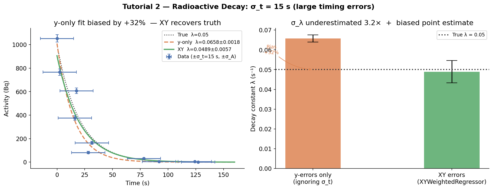

# Tutorial 2: Radioactive Decay with X and Y Errors

## The problem

You are measuring the activity of a radioactive source over time to determine its half-life. Each activity measurement has counting uncertainty (Poisson statistics: `σ_A = √A`). But the time measurements also carry uncertainty — the trigger electronics have ±15 second timing jitter, and early time points (t = 5 s) are barely longer than the timing error itself.

The decay model is:

```
A(t) = A₀ · exp(−λt)
```

where `A₀` is the initial activity and `λ` is the decay constant. The half-life follows as `T½ = ln(2) / λ`.

If you ignore the timing errors and only propagate counting uncertainty, you will:

1. **Bias the point estimate** — λ will be overestimated (half-life appears shorter than it is)
2. **Dramatically underestimate σ_λ** — you'll be overconfident by a factor of 3×

---

## Why `XYWeightedRegressor` here

The timing uncertainty `σ_t = 15 s` propagates into the activity through the model:

```
σ_A_eff_i² = σ_A_i² + |∂A/∂t|²_i · σ_t_i²
            = σ_A_i² + (λ · A(t_i))² · σ_t_i²
```

At early time points (t ≈ 5 s, A ≈ 750 Bq), `σ_t = 15 s` translates to:

```
λ · A · σ_t = 0.05 × 750 × 15 ≈ 562 Bq
```

This is far larger than the counting uncertainty (`σ_A = √750 ≈ 27 Bq`). Ignoring it is not conservative — **it is wrong**.

`XYWeightedRegressor` computes this automatically at each IRLS iteration via numdifftools, without requiring you to derive the partial derivative by hand.

---

## Setup

```python
import numpy as np
from mcup import WeightedRegressor, XYWeightedRegressor

np.random.seed(7)

# True decay parameters
A0_true = 1000.0    # Bq (initial activity)
lambda_true = 0.05  # 1/s  →  T½ ≈ 13.9 s

# Measurement times — sparse, irregular spacing as in a real experiment
t_true = np.array([0, 5, 10, 20, 35, 50, 70, 90, 120, 150], dtype=float)
A_true = A0_true * np.exp(-lambda_true * t_true)

# Counting uncertainty (Poisson)
sigma_A = np.sqrt(A_true)
A_meas = np.clip(A_true + np.random.normal(0, sigma_A), 1.0, None)

# Timing uncertainty: ±15 s (electronics jitter + trigger delay)
sigma_t = 15.0 * np.ones_like(t_true)
t_meas = np.maximum(t_true + np.random.normal(0, sigma_t), 0.0)
```

The 15-second timing error means the first measurement at `t ≈ 5 s` could easily have been taken at t = 0 or t = 20 s.

---

## What happens if you ignore the timing errors?

```python
def decay(t, p):
    return p[0] * np.exp(-p[1] * t)

# y-only: ignores timing errors entirely
est_y = WeightedRegressor(decay, method="analytical")
est_y.fit(t_meas, A_meas, y_err=sigma_A, p0=[900.0, 0.04])

bias_pct = (est_y.params_[1] - lambda_true) / lambda_true * 100
print(f"y-only  λ = {est_y.params_[1]:.4f} ± {est_y.params_std_[1]:.4f} s⁻¹")
print(f"Bias: {bias_pct:+.0f}%  (true λ = {lambda_true})")
```

```
y-only  λ = 0.0658 ± 0.0018 s⁻¹
Bias: +32%  (true λ = 0.05)
```

The fit overestimates λ by **+32%** — the apparent half-life is 10.5 s instead of the true 13.9 s. The timing scatter looks like the source is decaying faster than it is.

---

## Correct fit with `XYWeightedRegressor`

```python
est_xy = XYWeightedRegressor(decay, method="analytical")
est_xy.fit(t_meas, A_meas, x_err=sigma_t, y_err=sigma_A, p0=[900.0, 0.04])

ratio = est_xy.params_std_[1] / est_y.params_std_[1]
print(f"XY      λ = {est_xy.params_[1]:.4f} ± {est_xy.params_std_[1]:.4f} s⁻¹")
print(f"Uncertainty ratio: {ratio:.2f}×  (XY / y-only)")
```

```
XY      λ = 0.0489 ± 0.0057 s⁻¹
Uncertainty ratio: 3.19×  (XY / y-only)
```

`XYWeightedRegressor` recovers the true λ = 0.05. The uncertainty is **3× larger** — not because the method is less precise, but because the y-only method was overconfident by a factor of 3.

---

## Results at a glance



The left panel shows both fits. The y-only curve (dashed orange) visibly misses the true decay (dotted black line), while XY (solid green) tracks it closely. The right panel shows the bar comparison: the y-only point estimate is biased high (+32%), and its error bar is 3× too small.

| | True | y-errors only | XYWeightedRegressor |
|---|---|---|---|
| λ (s⁻¹) | 0.0500 | 0.0658 (**+32% bias**) | 0.0489 ✓ |
| σ_λ | — | 0.0018 (**3× too small**) | 0.0057 (honest) |
| T½ (s) | 13.86 | 10.52 (wrong) | 14.17 ✓ |

The y-only result would lead you to report a half-life that is **3.3 seconds too short** — a 24% error. In a nuclear physics context, this is the difference between two isotopes.

---

## Using the Monte Carlo solver

When the model is nonlinear, MC gives an independent check on the analytical result:

```python
est_mc = XYWeightedRegressor(decay, method="mc", n_iter=3000)
np.random.seed(1)
est_mc.fit(t_meas, A_meas, x_err=sigma_t, y_err=sigma_A, p0=[900.0, 0.04])

print(f"MC  λ = {est_mc.params_[1]:.4f} ± {est_mc.params_std_[1]:.4f} s⁻¹")
```

If the MC and analytical results agree, you can trust the analytical covariance. If they diverge, the model is likely poorly identified near the optimum and MC is safer.

---

## Key takeaways

- With large x-errors relative to x-values, ignoring `σ_x` causes **both bias and underestimated uncertainties** — not just the latter.
- `XYWeightedRegressor` corrects both automatically via IRLS with combined variance.
- The correction grows with `|∂f/∂x| · σ_x / σ_y`. When this ratio exceeds ~0.5, x-errors dominate and cannot be ignored.
- The combined variance formula is computed via automatic differentiation (numdifftools) — no manual derivatives needed.
