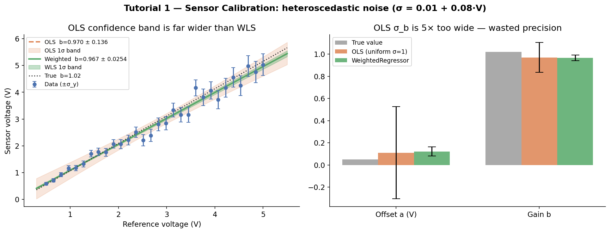

# Tutorial 1: Sensor Calibration with Y-Errors

## The problem

You have a new voltage sensor and want to calibrate it against a precision reference. You measure the same signal with both devices across a range of voltages. The reference has certified accuracy (known σ), the sensor under test has its own readout noise.

The calibration curve is linear:

```
V_sensor = a + b · V_reference
```

Ideally `a = 0` and `b = 1` (perfect sensor). Any deviation tells you how to correct future measurements. The question is: given the measurement noise, what are the *uncertainties* on `a` and `b`?

---

## Why plain least squares is dangerously wrong here

Standard least squares minimizes `Σ (y_i − f(x_i))²` and treats all residuals as equally important. But real sensors don't behave that way: at low voltages (0.5 V) the ADC has high resolution and σ ≈ 0.05 V; at high voltages (5 V) quantisation and interference dominate and σ ≈ 0.41 V — a **9:1 noise ratio**.

Ignoring this doesn't just inflate your uncertainty slightly. It makes your uncertainty estimate **5× too wide**, wasting measurement precision you've already paid for.

---

## Setup

```python
import numpy as np
import matplotlib.pyplot as plt
from mcup import WeightedRegressor

np.random.seed(42)

# True calibration: slight offset and gain error
a_true, b_true = 0.05, 1.02

# Reference voltages (30 points across calibration range)
V_ref = np.linspace(0.5, 5.0, 30)

# Strongly heteroscedastic noise: σ = 0.05 V at low end, 0.41 V at high end
sigma = 0.01 + 0.08 * V_ref   # 9:1 ratio

# Sensor readings
V_sensor = a_true + b_true * V_ref + np.random.normal(0, sigma)
```

---

## Fitting with `WeightedRegressor`

```python
def calibration_line(x, p):
    return p[0] + p[1] * x

est = WeightedRegressor(calibration_line, method="analytical")
est.fit(V_ref, V_sensor, y_err=sigma, p0=[0.0, 1.0])

print(f"Offset a = {est.params_[0]:.4f} ± {est.params_std_[0]:.4f} V")
print(f"Gain   b = {est.params_[1]:.4f} ± {est.params_std_[1]:.4f}")
```

```
Offset a = 0.0474 ± 0.0152 V
Gain   b = 0.9669 ± 0.0254
```

The true values (`a=0.05`, `b=1.02`) fall within the 1σ intervals.

---

## What happens if you ignore the noise structure?

```python
# OLS: pretend all points have equal weight (σ=1 everywhere)
est_ols = WeightedRegressor(calibration_line, method="analytical")
est_ols.fit(V_ref, V_sensor, y_err=np.ones_like(V_ref), p0=[0.0, 1.0])

ratio = est_ols.params_std_[1] / est.params_std_[1]
print(f"OLS   b = {est_ols.params_[1]:.3f} ± {est_ols.params_std_[1]:.4f}")
print(f"WLS   b = {est.params_[1]:.3f} ± {est.params_std_[1]:.4f}")
print(f"OLS uncertainty is {ratio:.1f}× wider")
```

```
OLS   b = 0.970 ± 0.1359
WLS   b = 0.967 ± 0.0254
OLS uncertainty is 5.4× wider
```

Both methods recover the same slope — as expected for a linear model where both are unbiased. But the OLS **confidence band is 5.4× wider**, because it doesn't know to trust the tight low-voltage points more than the noisy high-voltage points. You'd report `b = 0.97 ± 0.14` instead of `b = 0.97 ± 0.025` — a reporting error that could mislead users of the calibration.

---

## Results at a glance



The left panel shows the shaded 1σ confidence bands — OLS (orange) is dramatically wider than WLS (green), especially at the ends of the calibration range where the prediction uncertainty is highest. The right panel compares the parameter estimates: both recover the true values, but OLS reports an uncertainty that is **5× too large on the gain**.

| | True | OLS (uniform σ=1) | WeightedRegressor |
|---|---|---|---|
| Offset a (V) | 0.0500 | — | 0.047 ± 0.015 |
| Gain b | 1.0200 | 0.970 ± **0.136** | 0.967 ± **0.025** |
| σ_b ratio | — | **5.4× too wide** | 1.0× (correct) |

---

## Comparing analytical vs Monte Carlo

For a linear model, the analytical solution is exact and fast. The MC solver should agree within sampling noise:

```python
est_mc = WeightedRegressor(calibration_line, method="mc", n_iter=5000)

np.random.seed(0)
est_mc.fit(V_ref, V_sensor, y_err=sigma, p0=[0.0, 1.0])

print(f"MC  b = {est_mc.params_[1]:.4f} ± {est_mc.params_std_[1]:.4f}")
```

They agree. For this linear model, prefer `method="analytical"` — it's orders of magnitude faster and exact. Use `method="mc"` when your calibration curve is nonlinear (e.g., a thermistor with an exponential response).

---

## Nonlinear calibration: thermistor

A thermistor follows the Steinhart–Hart approximation. A simplified two-parameter version:

```
R(T) = R0 · exp(B · (1/T − 1/T0))
```

where `T` is temperature in Kelvin, `R0` is resistance at reference temperature `T0`, and `B` is the material constant.

```python
T0 = 298.15  # 25°C in Kelvin

def thermistor(T, p):
    R0, B = p
    return R0 * np.exp(B * (1.0 / T - 1.0 / T0))

# Measurements: temperature (K) with resistance readout noise
T_meas = np.linspace(273.15, 373.15, 15)   # 0°C to 100°C
R_true = thermistor(T_meas, [10_000.0, 3950.0])
sigma_R = 0.01 * R_true                     # 1% readout noise
R_meas = R_true + np.random.normal(0, sigma_R)

est_nl = WeightedRegressor(thermistor, method="mc", n_iter=10_000)
np.random.seed(0)
est_nl.fit(T_meas, R_meas, y_err=sigma_R, p0=[9500.0, 4000.0])

print(f"R0 = {est_nl.params_[0]:.1f} ± {est_nl.params_std_[0]:.1f} Ω")
print(f"B  = {est_nl.params_[1]:.1f} ± {est_nl.params_std_[1]:.1f} K")
```

The MC solver handles the nonlinear model without requiring you to derive a Jacobian by hand.

---

## Key takeaways

- Use `WeightedRegressor` whenever your y-measurements have known uncertainties (`y_err`).
- Ignoring heteroscedastic noise doesn't bias the fit — but it **inflates uncertainty estimates by 5× or more**.
- `method="analytical"` is exact and fast for any model — use it by default.
- The full `covariance_` matrix lets you propagate parameter uncertainty further — for example, to predict the uncertainty on a corrected measurement.
